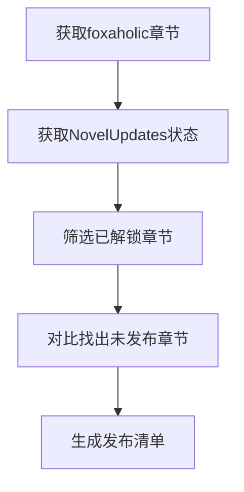

# Novel Sync Helper - 小说章节同步工具

自动同步 foxaholic.com 小说章节到 NovelUpdates.com 的油猴脚本。

## 功能特点

- 🔍 **智能章节检测**: 自动提取 foxaholic 网站的章节信息
- 📊 **状态对比**: 通过 NovelUpdates 现有发布状态判断需要同步的章节
- 🚀 **一键发布**: 自动打开并填充 NovelUpdates 发布表单
- ⚙️ **配置管理**: 每部小说独立配置，支持自动同步设置
- 🎯 **智能过滤**: 只发布已解锁且未在 NovelUpdates 发布的章节

## 安装步骤

### 1. 安装 Tampermonkey

首先需要在浏览器中安装 Tampermonkey 扩展：

- [Chrome 网上应用店](https://chrome.google.com/webstore/detail/tampermonkey/dhdgffkkebhmkfjojejmpbldmpobfkfo)
- [Firefox 附加组件](https://addons.mozilla.org/firefox/addon/tampermonkey/)
- [Edge 外接程序](https://microsoftedge.microsoft.com/addons/detail/tampermonkey/iikmkjmpaadaobahmlepeloendndfphd)

### 2. 安装脚本

1. 打开 Tampermonkey 管理面板
2. 点击「添加新脚本」
3. 复制 `userscript/novel-sync.user.js` 文件内容
4. 粘贴到编辑器中并保存

### 3. 访问支持的网站

脚本会在以下网站自动激活：
- `https://18.foxaholic.com/wp-admin/*` (foxaholic 后台)
- `https://www.novelupdates.com/*` (NovelUpdates)

## 使用指南

### 首次配置

1. **登录 foxaholic 后台**
   - 访问 `https://18.foxaholic.com/wp-admin/edit.php?post_type=wp-manga`
   - 脚本会在右上角显示控制面板

2. **扫描小说列表**
   - 点击「扫描小说」按钮
   - 脚本会自动识别所有小说

3. **进入小说编辑页面**
   - 点击任意小说进入编辑页面
   - 脚本控制面板会显示章节分析选项

4. **配置同步设置**
   ```
   - NovelUpdates URL: https://www.novelupdates.com/series/your-novel-name/
   - 系列标题: 小说的英文标题（用于表单自动补全）
   - 翻译组: 你的翻译组名称
   - 自动同步: 是否启用定时同步检查
   ```

### 日常使用

1. **章节分析**
   - 在小说编辑页面点击「分析章节」
   - 查看已解锁和锁定章节统计

2. **执行同步**
   - 点击「同步到NovelUpdates」
   - 脚本会自动：
     - 获取 foxaholic 章节状态
     - 检查 NovelUpdates 已发布章节
     - 计算需要发布的章节列表

3. **批量发布**
   - 同步完成后如有待发布章节
   - 点击「发布章节」按钮
   - 脚本会为每个章节打开新的发布页面

## 工作原理

### 数据提取

脚本通过分析页面DOM结构提取信息：

```javascript
// foxaholic 章节列表
#wp-manga-chapters .chapters .chapter-item
- 章节标题和链接
- 发布日期（判断是否锁定）
- 章节状态

// NovelUpdates 已发布章节
.chp-release
- 章节号
- 发布日期
```

### 状态同步逻辑



### 发布流程

1. 打开 NovelUpdates 发布页面
2. 自动填充表单字段：
   - 系列名称（自动补全）
   - 章节号
   - 章节标题
   - 发布日期
   - 章节链接
   - 翻译组
3. 等待用户手动提交

## 故障排除

### 常见问题

**Q: 脚本没有显示控制面板**
- 检查是否正确安装 Tampermonkey
- 确认访问的是支持的网站地址
- 查看浏览器控制台是否有错误信息

**Q: 无法检测章节信息**
- 确认页面已完全加载
- 检查网站结构是否发生变化
- 尝试刷新页面

**Q: 发布表单填充失败**
- 检查浏览器是否阻止了弹窗
- 确认 NovelUpdates 网站结构未改变
- 手动验证配置信息是否正确

**Q: 同步状态不准确**
- 检查 NovelUpdates URL 是否正确
- 确认网络连接正常
- 验证章节号匹配逻辑

### 调试模式

打开浏览器开发者工具（F12），查看控制台输出：

```javascript
// 查看脚本状态
console.log('Novel Sync Helper 状态');

// 查看配置信息
console.log(window.NovelSyncConfig.getAllNovels());

// 查看同步报告
// 执行同步后会输出详细信息
```

## 技术细节

### 支持的章节格式

- `Chapter 1`, `Chapter 1.5`
- `第1章`, `第1.5章`
- 纯数字格式: `1`, `1.5`

### 数据存储

使用 Tampermonkey 的 GM_setValue API 本地存储：
- 小说配置信息
- 同步历史记录
- 用户设置

### 安全特性

- 只在指定域名运行
- 不会自动提交发布表单
- 所有数据本地存储
- 无服务器通信

## 更新日志

### v1.0.0
- 初始版本发布
- 基础章节检测和同步功能
- 配置管理界面
- 批量发布支持

## 贡献指南

欢迎提交问题和改进建议！

### 开发环境设置

1. 克隆项目：
   ```bash
   git clone [project-url]
   cd syn-nv
   ```

2. 项目结构：
   ```
   syn-nv/
   ├── userscript/
   │   └── novel-sync.user.js    # 主脚本文件
   ├── src/
   │   ├── config-manager.js     # 配置管理模块
   │   └── sync-engine.js        # 同步引擎
   └── docs/
       └── brief.md              # 项目规划文档
   ```

3. 修改脚本后在 Tampermonkey 中重新加载测试

## 许可证

本项目采用 MIT 许可证 - 详见 [LICENSE](LICENSE) 文件